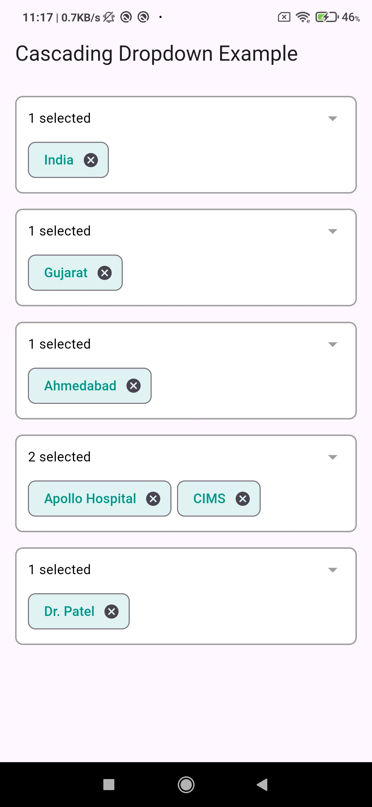

# example

A new Flutter project.

## Getting Started

This project is a starting point for a Flutter application.

A few resources to get you started if this is your first Flutter project:

- [Lab: Write your first Flutter app](https://docs.flutter.dev/get-started/codelab)
- [Cookbook: Useful Flutter samples](https://docs.flutter.dev/cookbook)

For help getting started with Flutter development, view the
[online documentation](https://docs.flutter.dev/), which offers tutorials,
samples, guidance on mobile development, and a full API reference.

# dependent_multiselect_search_dropdown

A customizable Flutter widget for multi-select, searchable, and dependent dropdowns.

TThe dependent_multiselect_search_dropdown widget provides cascading dropdowns, meaning the options in each dropdown are dependent on the previous selection. For example, once you select a country, the available states will be filtered based on that country, and similarly, cities will depend on the selected state.

Dynamic Data Handling:
If you remove a selection in any dropdown (e.g., if you unselect a country), all the dependent dropdowns (like state and city) will reset and the user will need to start the selection process again.

This ensures that the data remains consistent and prevents users from making invalid selections (such as selecting a state when no country is chosen).

Example Explanation for Users:
Step 1: Select a Country.

Step 2: The State dropdown will be updated with only the states relevant to the selected country.

Step 3: The City dropdown will show cities based on the selected state.

If you decide to remove any selection, the dependent dropdowns will reset, and you will need to re-select the options starting from the first dropdown.

## ✨ Features

- ✅ Cascading dropdowns (e.g., Country → State → City)
- 🔍 Searchable options
- ✅ Single & Multi-selection support
- 🔄 Dynamically update dropdown data
- 🚫 Error validation for empty selection

## 📦 Installation

Add this to your `pubspec.yaml`:

```yaml
dependencies:
  dependent_multiselect_search_dropdown: ^1.0.0
```

## Screenshots


_Example of cascading dropdown with country, state, and city._


_Another view showing the multi-selection dropdown._


_Example of cascading dropdown with country, state, and city._


_Another view showing the multi-selection dropdown._


## Demo Video

Check out the demo videos for the package:

[](https://www.youtube.com/shorts/9c93fJ3yyyY)
_This video demonstrates the cascading dropdown feature in action._

[](https://www.youtube.com/shorts/3ZFJjEoIv6U)
_This video showcases the multi-selection feature._
