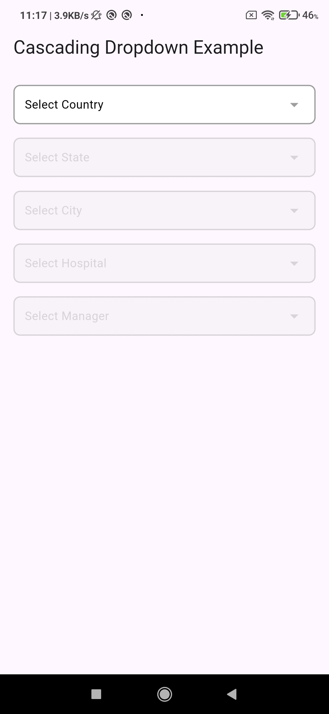
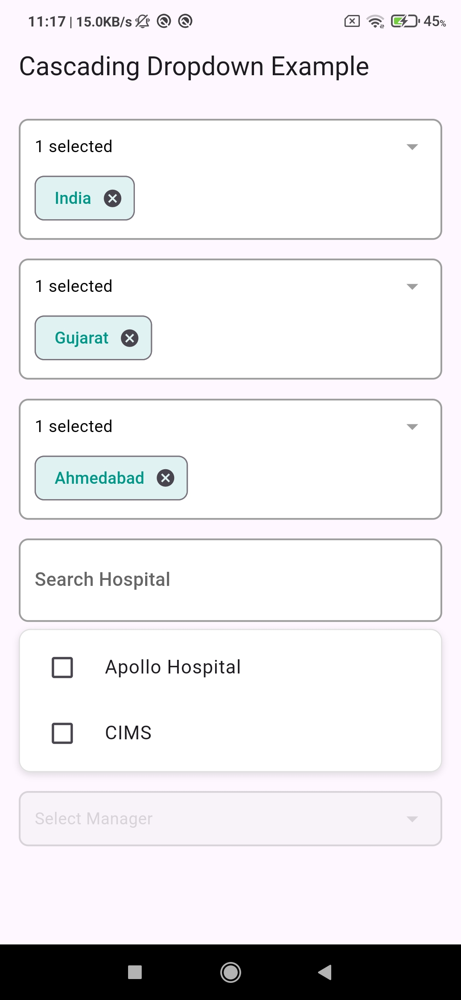
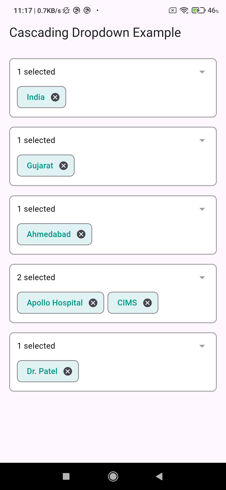

# dependent_multiselect_search_dropdown 🗂️

A customizable Flutter widget for **multi-select**, **searchable**, and **dependent dropdowns**.

The `dependent_multiselect_search_dropdown` widget provides **cascading dropdowns**, meaning the options in each dropdown are dependent on the previous selection. For example, once you select a **country**, the available **states** will be filtered based on that country, and similarly, **cities** will depend on the selected state.

---

## ⚙️ How It Works

The `DependentMultiSelectDropdown` widget works by linking multiple dropdowns together. Each dropdown is dependent on the previous one. When a selection is made in one dropdown, the next dropdown's options are filtered based on the previous choice.

---

## 🔄 Dynamic Data Handling:

If you **remove** a selection in any dropdown (e.g., if you unselect a **country**), all the dependent dropdowns (like **state** and **city**) will **reset** and the user will need to start the selection process again.

This ensures that the data remains **consistent** and prevents users from making invalid selections (such as selecting a state when no country is chosen).

---

## 📝 Example Explanation for Users:

1. **Step 1**: Select a **Country**.
2. **Step 2**: The **State** dropdown will be updated with only the states relevant to the selected country.
3. **Step 3**: The **City** dropdown will show cities based on the selected state.

If you decide to **remove** any selection, the dependent dropdowns will reset, and you will need to re-select the options starting from the first dropdown.

---

## ✨ Features

- ✅ Cascading dropdowns (e.g., Country → State → City)
- 🔍 Searchable options
- ✅ Single & Multi-selection support
- 🔄 Dynamically update dropdown data
- 🚫  Error validation for a value that is not in the list

## 🚀 Installation

Add this to your `pubspec.yaml`:

```yaml
dependencies:
  dependent_multiselect_search_dropdown: ^1.1.3
```

🛠️ Feedback and Contributions
We welcome feedback, suggestions, and contributions! Feel free to open an issue or submit a pull request.


📸 Screenshot









▶ Demo Video

Check out the demo videos for the package:

[](https://www.youtube.com/shorts/9c93fJ3yyyY)

_This video demonstrates the cascading dropdown feature in action._

[](https://www.youtube.com/shorts/3ZFJjEoIv6U)

_This video showcases the multi-selection feature._
