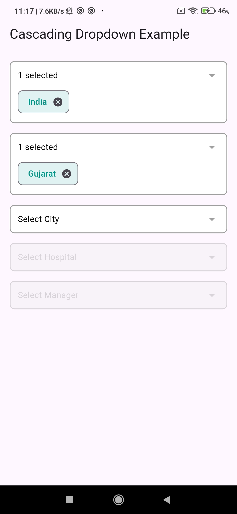
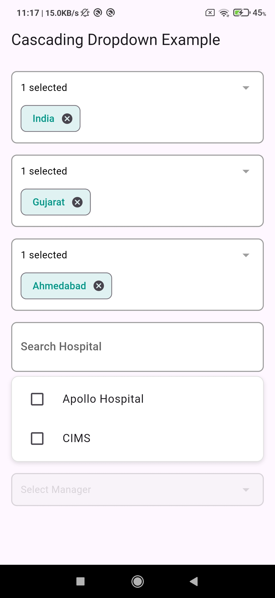

# example

A new Flutter project.

## Getting Started

This project is a starting point for a Flutter application.

A few resources to get you started if this is your first Flutter project:

- [Lab: Write your first Flutter app](https://docs.flutter.dev/get-started/codelab)
- [Cookbook: Useful Flutter samples](https://docs.flutter.dev/cookbook)

For help getting started with Flutter development, view the
[online documentation](https://docs.flutter.dev/), which offers tutorials,
samples, guidance on mobile development, and a full API reference.

# dependent_multiselect_search_dropdown

A customizable Flutter widget for multi-select, searchable, and dependent dropdowns.

This widget allows cascading dropdown behavior where the selection of one dropdown (like country) filters the next (like state → city). It supports single and multi-selection, dynamic updates, and search functionality.

## ✨ Features

- ✅ Cascading dropdowns (e.g., Country → State → City)
- 🔍 Searchable options
- ✅ Single & Multi-selection support
- 🔄 Dynamically update dropdown data
- 🚫 Error validation for empty selection

## 📦 Installation

Add this to your `pubspec.yaml`:

```yaml
dependencies:
  dependent_multiselect_search_dropdown: ^1.0.0

## Screenshots


_Example of cascading dropdown with country, state, and city._


_Another view showing the multi-selection dropdown._


_Another view showing the multi-selection dropdown._


_Another view showing the multi-selection dropdown._

## Demo Video

Check out the demo videos for the package:

[

[
